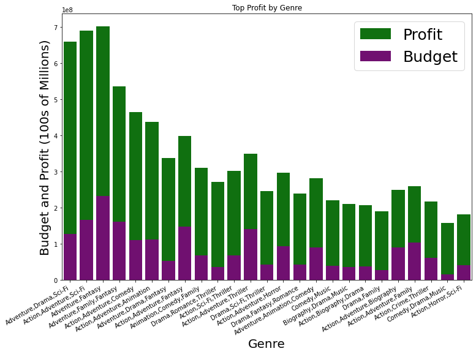
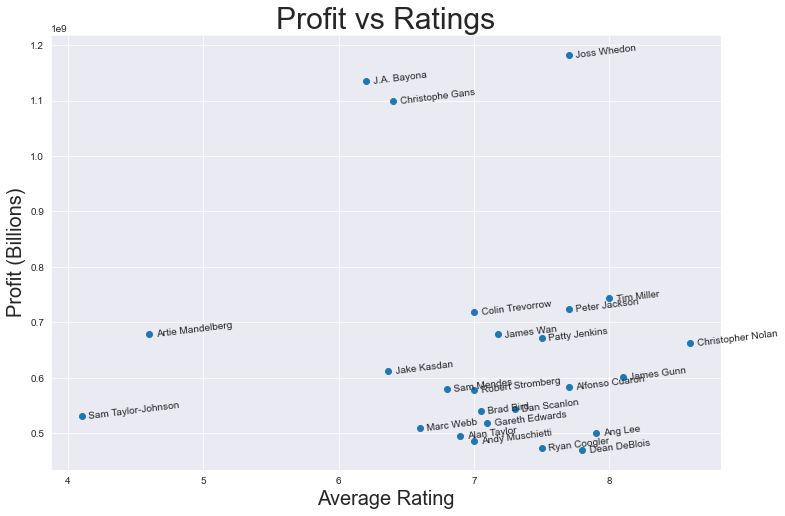
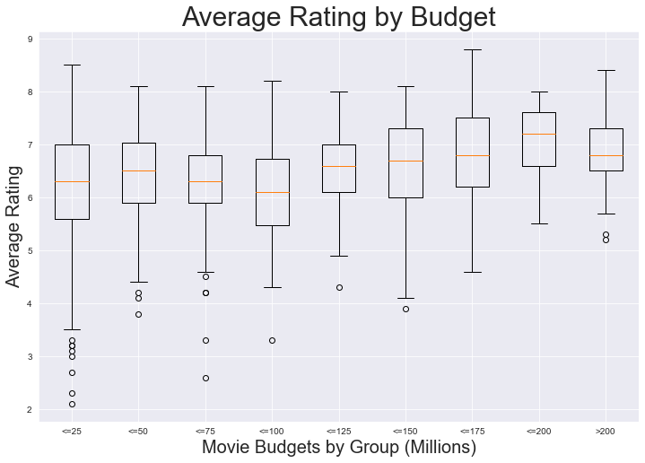

# Movie Analysis for Microsoft

**Author**: Benjamin Dean

## Overview

This project is intended to display an understanding of the material covered in Phase 1 of the Flatiron School's Part Time Data Science program. Students were given a business problem within which the Microsoft Corporation is opening their own movie studio and needs guidance for successful production. Data supplied from multiple online movie databases is read, cleaned, and modeled to provide insight into which movie attributes generate the most profit and the highest ratings. The analysis performed in this project concludes that Microsoft should begin their production with movies containing the genres: action, adventure, fantasy, and sci-fi, that they should begin their process with talented directors: Tim Miller, Peter Jackson, or Christopher Nolan, and that 

## Business Problem
Big technology has entered the film industry. Apple, Amazon and Netflix all either produce or procure their own original content. Microsoft looks to capitalize on their ability to distribute digital media and has decided to join the industry by starting their own movie studio. Microsoft has asked the students of Flatiron School to perform a data analysis and advise them on how to create a successful film studio. First we considered what it is that defines a successful movie and figured it to be a movies longevity, it's reception, and it's profit. We therefore determined these to be the most revealing questions.

***
* Which genres produce the most profit?
* Which directors are best to work with?
* Is there a relationship between the money invested in production and the rating of a movie?
***

## Data

This project explores six datasets(chosen from the eleven datasets provided) from IMDB.com, TheMovieDb.org, and the-numbers.com.  These datasets were determined best fit to answer the business problem because they contained information on production budgets, worlwide gross, director names, etc. They were also simple to merge given their common classifications. Our target variable was profit and we used data including genre, director name, and production budget to project profitability.

## Methods

We began with data preparation that included removing unwanted data and characters, renaming columns, and converting series. We then merged datasets and created a new column named 'profit'. Data was selected and plotted using Python libraries matplotlib and seaborn to display relationships between our target variable and numerous other variables.  

## Results

We first compared genres and their respective average profits to reveal the highest earning genres.
Our data analysis suggests movies containing action, adventure, fantasy, and sci-fi genres are most profitable.

This analysis shows that when looking to generate a combination of the highest profits and the highest ratings consider the directors Joss Whedon, Tim Miller, Peter Jackson, or Christopher Nolan.

For this graph we categorized each movie into a budget range and charted each groups average rating.

However, data was limited and may not be an accurate indicator. Because our data only included movies within the years ranged 2010-2019 directors and genres were often limited to just one movie.

## Conclusions
Based on our data analysis we guide Microsoft to produce movies with a target budget of x. In addition, we advise Microsoft select scripts within the action, adventure, fantasy and sci-fi genres. Finally, plots graphed on the axis average ratings and average worldwide profit displayed that * in these fields are Joss Whedon, Christopher Nolan 

One issue with analysis was movies not having a primary genre which them difficult to categorize
Bringing in more data via API or webscraping could be more useful. Further analysis include data that provides information about how often 
movies are rewatched and whether they are franchise worthy.
