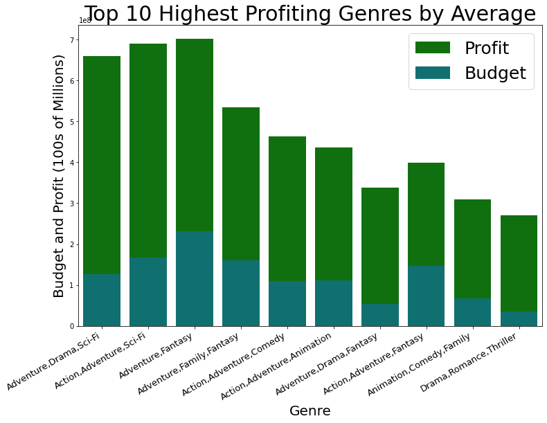

# Movie Analysis for Microsoft

**Author**: Benjamin Dean

## Overview
Appetite for content is insatiable. And so, big technology has made major investments in the film industry. Apple, Amazon, and Netflix all either produce or procure their own original content. Now, Microsoft Corporation looks to capitalize on their ability to distribute digital media and has decided to join the industry by starting their own movie studio. However, despite their experience and expertise in so many industries, Microsoft has reached out for advice on how to begin producing successful movies. This project focuses on the application of the data science process to perform general analyses on movie data.

## Business Problem

* Which genres produce the most profit?
* Which directors deliver the highest profits and the best ratings?
* Is there a correlation between the money invested in production and the rating of a movie?
***

## Data

This project explores six datasets from IMDB.com, TheMovieDb.org, and the-numbers.com.  These datasets were determined best fit to answer the business problems because they contained information on production budgets, worlwide gross, director names, etc. They were also simple to merge given their common classifications. Data contained 1213 observations from the decade 2010 to 2019. The target variable for this project was profit and I used data including genre, director name, and production budget to project profitability.

## Methods

I began with data preparation that included removing unwanted data and characters, renaming columns, and converting series. I then merged datasets and created a new column named 'profit' by subtracting production budgets from the worldwide grosses. Data was selected and plotted using Python libraries matplotlib and seaborn to display relationships between the target variable and numerous other variables.  

## Results

I first compared genres and their respective average profits to reveal the highest earning genres.
My data analysis suggests movies containing action, adventure, fantasy, and sci-fi genres are most profitable.

This analysis shows that when looking to generate a combination of the highest profits and the highest ratings Microsoft should consider the directors Joss Whedon, Tim Miller, Peter Jackson, or Christopher Nolan.

For this graph I categorized each movie into a budget range and charted each groups average rating.

## Conclusions
Based on the analysis described in this project, I guide Microsoft to produce movies with a target budget of $176mm. In addition, we advise Microsoft select scripts within the action, adventure, fantasy and sci-fi genres. Finally, plots graphed on the axis' average ratings and average worldwide profit displayed that the best grossing directors within these criterion are Joss Whedon, Christopher Nolan, Tim Miller, and Peter Jackson. 

## Next Steps
Bringing in more data via API or webscraping could be more useful. Further analysis could include data that provides information about how often 
movies are rewatched and whether they are franchise worthy. However, data was limited and may not be an accurate indicator. Because our data only included movies within the years ranged 2010-2019 directors and genres were often limited to just one movie.
